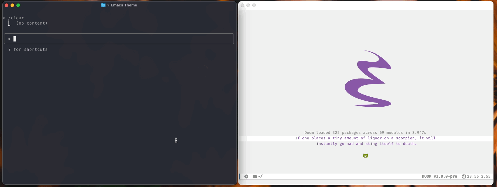
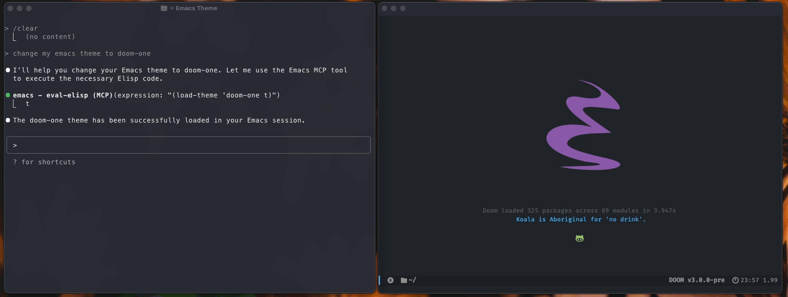
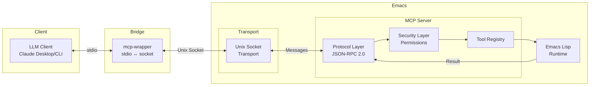

# MCP Server for Emacs

[](https://github.com/rhblind/emacs-mcp-server/actions/workflows/test.yml)
[](https://www.gnu.org/licenses/gpl-3.0)
[](https://www.gnu.org/software/emacs/)

Connect Large Language Models directly to your Emacs environment! This MCP (Model Context Protocol) server exposes Emacs functionality through standardized tools,
allowing LLMs like Claude to read and modify your buffers, execute elisp code, navigate files, and much more.

<div align="center">
  
  <br><br>
  
</div>

## Quick Start

**Installation:** Place the files in your Emacs configuration directory and add to your config:

```elisp
(add-to-list 'load-path "~/path-to/mcp-server")
(require 'mcp-server)
```

Alternatively, use package managers:

```elisp
;; Using straight.el
(use-package mcp-server
  :straight (:type git :host github :repo "rhblind/emacs-mcp-server"
             :files ("*.el" "tools/*.el" "mcp-wrapper.py" "mcp-wrapper.sh"))
  :config
  (add-hook 'emacs-startup-hook #'mcp-server-start-unix))

;; Using use-package with manual path
(use-package mcp-server
  :load-path "~/path-to/mcp-server"
  :config
  (add-hook 'emacs-startup-hook #'mcp-server-start-unix))

;; Using Doom Emacs package! macro
(package! mcp-server
  :recipe (:type git :host github :repo "rhblind/emacs-mcp-server"
           :files ("*.el" "tools/*.el" "mcp-wrapper.py" "mcp-wrapper.sh")))
```

**Start the server:** Run `M-x mcp-server-start-unix` in Emacs. The server creates a Unix socket at `~/.config/emacs/.local/cache/emacs-mcp-server.sock`. 

**Connect Claude Desktop:** Add this to your Claude Desktop configuration:

> [!NOTE]
> Make sure you have `socat` installed!

```json
{
  "mcpServers": {
    "emacs": {
      "command": "socat",
      "args": ["-", "UNIX-CONNECT:~/.config/emacs/.local/cache/emacs-mcp-server.sock"],
      "transport": "stdio"
    }
  }
}
```

**Connect Claude CLI**

```bash
claude mcp add emacs -- socat - UNIX-CONNECT:$HOME/.config/emacs/.local/cache/emacs-mcp-server.sock  # Uses socat directly
claude mcp add emacs ~/path-to/mcp-wrapper.py ~/.config/emacs/.local/cache/emacs-mcp-server.sock     # Uses the python wrapper script
claude mcp add emacs ~/path-to/mcp-wrapper.sh ~/.config/emacs/.local/cache/emacs-mcp-server.sock     # Uses the bash wrapper script

# Optionally, add to user scope so it's always available
claude mcp add emacs --scope user -- socat - UNIX-CONNECT:$HOME/.config/emacs/.local/cache/emacs-mcp-server.sock
```

Claude can now interact with your Emacs session.

## What LLMs Can Do

Once connected, LLMs can perform powerful operations in your Emacs environment:

**Code and Text Manipulation**
- Read and write any buffer - get content from files, scratch buffers, terminals
- Execute elisp code - run any Emacs Lisp expression safely 
- Navigate and edit - move cursor, insert text, select regions
- Manage files - open, save, create new files and buffers

**Emacs Integration**
- Run interactive commands - execute any `M-x` command programmatically
- Access variables - read and modify Emacs configuration and state
- Window management - get layout information, manage splits
- Major mode operations - work with mode-specific functionality

## Available Tools

### eval-elisp

Executes an arbitrary Elisp expression in the running Emacs process and returns the printed result. The expression passes through the security layer, which blocks dangerous functions and credential-bearing files (see [Security](#security)).

**Parameters:**
| Parameter    | Type   | Required | Description                       |
|--------------|--------|----------|-----------------------------------|
| `expression` | string | Yes      | The Elisp expression to evaluate. |

**Example response:**
```json
{
  "content": [
    {"type": "text", "text": "6"}
  ]
}
```

### get-diagnostics

Retrieves errors and warnings from flycheck or flymake (auto-detected per buffer) across all project buffers. Results are grouped by file and sorted by severity.

**Parameters:**
| Parameter   | Type   | Required | Description                                   |
|-------------|--------|----------|-----------------------------------------------|
| `file_path` | string | No       | Get diagnostics for a specific file only      |
| `severity`  | string | No       | Filter by `"error"`, `"warning"`, or `"info"` |

**Example response:**
```json
{
  "summary": {"total": 5, "errors": 2, "warnings": 3, "info": 0},
  "files": {
    "/path/to/file.el": {
      "error_count": 2,
      "warning_count": 1,
      "info_count": 0,
      "diagnostics": [
        {
          "line": 42,
          "column": 10,
          "message": "Unused variable 'foo'",
          "severity": "warning",
          "source": "emacs-lisp"
        }
      ]
    }
  }
}
```

### Org-mode Tools

The server ships 10 org-mode tools plus 3 org-roam-specific tools (the roam
tools register only when `org-roam` is installed).

**Read tools**

- `org-agenda` - structured agenda and TODO views.
- `org-search` - heading search using org's match syntax (`"+work-home/!TODO"` etc.).
- `org-get-node` - fetch a heading or file body.
- `org-list-templates` - enumerate the user's capture templates so the LLM
  can pick the right `template_key`.
- `org-list-tags` - enumerate existing tags with usage counts so the LLM can
  prefer reusing an established tag over creating a near-duplicate.

**Write tools**

- `org-capture` - create a new entry; template mode respects the user's
  `org-capture-templates` verbatim.
- `org-update-node` - update title, TODO state, priority, tags, properties,
  schedule, deadline, or body on an existing heading.
- `org-refile` - move a heading under another.
- `org-archive` - archive a heading to its configured archive target.
- `org-clock` - clock in, out, or cancel.

**Org-roam tools** (register only if `org-roam` is installed)

- `org-roam-search` - find nodes by title, alias, tag, or ref.
- `org-roam-get-node` - fetch a node with its backlinks.
- `org-roam-capture` - create a new node, respecting
  `org-roam-capture-templates`.

All write tools respect `mcp-server-emacs-tools-org-allowed-roots`, which
defaults to directories containing `org-directory` and `org-agenda-files`.
Writes auto-save the target buffer by default; set
`mcp-server-emacs-tools-org-auto-save` to `nil` to manage saves manually.

## Configuration

**Socket naming strategies:** Choose how sockets are named based on your setup:

```elisp
(setq mcp-server-socket-name nil)       ; Default: emacs-mcp-server.sock
(setq mcp-server-socket-name 'user)     ; User-based: emacs-mcp-server-{username}.sock  
(setq mcp-server-socket-name 'session)  ; Session-based: emacs-mcp-server-{username}-{pid}.sock
(setq mcp-server-socket-name "custom")  ; Custom: emacs-mcp-server-custom.sock
```

**Tool selection:** Choose which tools to enable:

```elisp
;; Enable all tools (default)
(setq mcp-server-emacs-tools-enabled 'all)

;; Enable only specific tools (disable eval-elisp for security)
(setq mcp-server-emacs-tools-enabled '(get-diagnostics))

;; Enable only eval-elisp
(setq mcp-server-emacs-tools-enabled '(eval-elisp))
```

**Other configuration options:**

```elisp
;; Custom socket directory
(setq mcp-server-socket-directory "~/.config/emacs-mcp/")

;; Auto-start server when Emacs starts
(add-hook 'emacs-startup-hook #'mcp-server-start-unix)

;; Enable debug logging
(setq mcp-server-debug t)
```

## Security

> [!WARNING]
> The MCP server implements certain security measures to protect your Emacs environment and sensitive data from unauthorized access by LLMs.
> However, the `eval-elisp` tool enables arbitrary evaluation of Elisp code in your Emacs process and therefore by definition enables remote code execution for the LLM.
> **Use this tool with extreme caution!**

### Security Features

**Permission System:**
- **Dangerous function protection** - Functions like `delete-file`, `shell-command`, `find-file`, `write-file`, `make-network-process`, `make-process`, `async-shell-command`, `setenv` require user approval
- **Sensitive file protection** - Automatic blocking of credential files (`.authinfo`, `.netrc`, SSH keys, etc.) for both reads and writes, even when the function itself is allowed
- **Buffer access controls** - Protection for sensitive buffers like `*Messages*`, `*shell*`, `*terminal*`
- **Permission caching** - Decisions are remembered for the session to avoid repeated prompts
- **Audit logging** - Complete trail of all security events and decisions

**Input Validation:**
- **JSON Schema validation** - All tool inputs are validated against defined schemas
- **Code injection protection** - Elisp expressions are scanned for dangerous patterns
- **Path traversal prevention** - File paths are validated to prevent directory escape attacks
- **Content scanning** - File contents are checked for credential patterns before access

**Execution Limits:**
- **Timeout protection** - Operations are limited to 30 seconds by default
- **Memory monitoring** - Resource usage is tracked during execution
- **Safe evaluation** - All Elisp code goes through security validation before execution

### Security Limitations

The security model provides defense-in-depth but has known limitations:

- **`let`-binding positions not fully checked** - The static form walker does not recurse into `let`/`let*` binding-value positions, so `(let ((x (shell-command "id"))) x)` bypasses the blocklist. Tracked in [#10](https://github.com/rhblind/emacs-mcp-server/issues/10).
- **Dynamic function construction** - Code can construct function names at runtime to evade static analysis: `(funcall (intern "delete-file") "/tmp/test")` passes the checker. Tracked in [#10](https://github.com/rhblind/emacs-mcp-server/issues/10).
- **Macro expansion** - The form walker operates on unexpanded forms. Macros that wrap dangerous calls in non-tail positions (other than `let` bindings) may not be caught.

**This means:** Using `eval-elisp` requires trusting the LLM completely. The security controls reduce risk of accidental harm but cannot prevent a determined adversary.

For higher security requirements, consider:
1. Restricting tool access via `mcp-server-emacs-tools-enabled`
2. Running Emacs in a sandboxed environment
3. Implementing an allowlist approach for truly critical systems

### Default Protected Files

The server automatically protects these sensitive file patterns.

Patterns starting with `~/` or `/` are matched as path prefixes after expanding `~`. Patterns containing `*` or `?` are treated as shell globs (e.g. `~/.authinfo*` matches `~/.authinfo`, `~/.authinfo.gpg`, `~/.authinfo.enc`, etc.). Bare filename patterns (no leading `~/`) match against the file's basename.

**Authentication Files:**
- `~/.authinfo` and variants - Emacs authentication data
- `~/.netrc` and variants - Network authentication credentials
- `~/.ssh/` - SSH keys and configuration (entire directory)
- `~/.gnupg/` - GPG keys and configuration (entire directory)

**Cloud & Service Credentials:**
- `~/.aws/` - AWS credentials
- `~/.docker/config.json` - Docker authentication
- `~/.kube/config` - Kubernetes configuration
- `~/.config/gh/` - GitHub CLI credentials

**System Files:**
- `/etc/passwd`, `/etc/shadow` - System authentication
- `~/.password-store/` - Password manager data
- Files containing "passwords", "secrets", "credentials", "keys", "tokens"

### Security Configuration

The default settings aim for a reasonable balance between security and usability: the most commonly dangerous functions are blocked, well-known credential files are protected, and operations fail silently rather than prompting. These defaults will not suit every workflow. You are encouraged to review them and adjust to your own needs, for example by tightening the dangerous function list, adding project-specific sensitive file patterns, or enabling prompts instead of silent denial.

Users have complete control over the security model through customizable settings:

**Customize Sensitive Files:**
```elisp
;; Add your own sensitive file patterns.
;; Patterns starting with ~/ or / are matched as path prefixes (after expanding ~).
;; Patterns containing * or ? are treated as shell globs.
;; Bare filename patterns match against the file's basename.
(setq mcp-server-security-sensitive-file-patterns
      '("~/.authinfo*"    ; glob: matches .authinfo, .authinfo.gpg, .authinfo.enc, ...
        "~/.ssh/"         ; prefix: matches everything under ~/.ssh/
        "~/my-secrets/"   ; prefix: matches everything under ~/my-secrets/
        ".key"))          ; basename: matches any file whose name contains ".key"

;; Allow specific sensitive files without prompting
(setq mcp-server-security-allowed-sensitive-files
      '("~/.ssh/known_hosts" "~/safe-config.txt"))
```

**Customize Dangerous Functions:**
```elisp
;; Modify which functions require permission
(setq mcp-server-security-dangerous-functions
      '(delete-file shell-command find-file write-region))

;; Allow specific functions without prompting  
(setq mcp-server-security-allowed-dangerous-functions
      '(find-file dired))  ; Allow file browsing freely
```

**Global Security Settings:**
```elisp
;; Block dangerous operations silently without prompting (default)
(setq mcp-server-security-prompt-for-permissions nil)

;; Customize execution timeout
(setq mcp-server-security-max-execution-time 60)  ; 60 seconds

;; Add custom sensitive buffer patterns
(setq mcp-server-security-sensitive-buffer-patterns
      '("*Messages*" "*shell*" "*my-secure-buffer*"))
```

**Use Emacs Customize Interface:**
```elisp
M-x customize-group RET mcp-server RET
```

### Security Modes

**Paranoid Mode:**
```elisp
;; Very restrictive - prompts for everything
(setq mcp-server-security-dangerous-functions
      '(find-file insert-file-contents switch-to-buffer eval load require))
(setq mcp-server-security-allowed-dangerous-functions nil)
(setq mcp-server-security-prompt-for-permissions t)
```

**Permissive Mode:**
```elisp
;; More relaxed for trusted development scenarios
(setq mcp-server-security-allowed-dangerous-functions
      '(find-file dired insert-file-contents))
;; Keep file protections for credentials
(setq mcp-server-security-sensitive-file-patterns
      '("~/.authinfo*" "~/.netrc*" "~/.ssh/" "~/.gnupg/"))
```

**Whitelist-Only Mode:**
```elisp
;; Only allow explicitly whitelisted operations
(setq mcp-server-security-prompt-for-permissions nil)  ; No prompts - just deny
(setq mcp-server-security-allowed-dangerous-functions '(buffer-string point))
(setq mcp-server-security-allowed-sensitive-files nil)  ; No sensitive files allowed
```

### Monitoring Security

**View Security Activity:**
```elisp
M-x mcp-server-security-show-audit-log     ; View all security events
M-x mcp-server-security-show-permissions   ; View cached permission decisions
M-x mcp-server-security-clear-permissions  ; Reset all cached permissions
```

**Security Events Include:**
- Permission requests (granted/denied)
- Sensitive file access attempts
- Dangerous function calls
- Security configuration changes
- Execution timeouts and errors

### Best Practices

1. **Keep defaults** - The default security settings provide good protection for most users
2. **Review audit logs** - Regularly check what the LLM has been trying to access
3. **Use whitelists** - For recurring workflows, whitelist specific safe operations
4. **Monitor credentials** - Be especially careful with any files containing passwords or API keys
5. **Test security** - Verify your configuration blocks unauthorized access as expected

Operations requiring explicit permission include file system operations (`delete-file`, `write-region`, `write-file`, `append-to-file`, `copy-file`, `rename-file`, `with-temp-file`), process execution (`shell-command`, `call-process`, `start-process`), network access (`make-network-process`, `open-network-stream`, `url-retrieve`), directory enumeration (`directory-files`, `directory-files-recursively`), system functions (`kill-emacs`, `server-start`), and access to sensitive files or buffers.

## Management Commands

**Server control:** `M-x mcp-server-start-unix` (start), `M-x mcp-server-stop` (stop), `M-x mcp-server-restart` (restart), `M-x mcp-server-status` (show status)
**Debugging and monitoring:** `M-x mcp-server-toggle-debug` (toggle debug logging), `M-x mcp-server-list-clients` (show connected clients), `M-x mcp-server-get-socket-path` (show socket path)
**Security management:** `M-x mcp-server-security-show-audit-log` (view security log), `M-x mcp-server-security-show-permissions` (view cached permissions)

## Client Integration

### Claude Desktop

**Using shell wrapper (recommended):**
```json
{
  "mcpServers": {
    "emacs": {
      "command": "/path/to/mcp-wrapper.sh",
      "args": ["$HOME/.emacs.d/.local/cache/emacs-mcp-server.sock"],
      "transport": "stdio"
    }
  }
}
```

**Using Python wrapper:**
```json
{
  "mcpServers": {
    "emacs": {
      "command": "python3",
      "args": ["/path/to/mcp-wrapper.py", "$HOME/.emacs.d/.local/cache/emacs-mcp-server.sock"],
      "transport": "stdio"
    }
  }
}
```

**Direct socat (simple but less robust):**
```json
{
  "mcpServers": {
    "emacs": {
      "command": "socat",
      "args": ["-", "UNIX-CONNECT:$HOME/.emacs.d/.local/cache/emacs-mcp-server.sock"],
      "transport": "stdio"
    }
  }
}
```

### Wrapper Scripts

**Shell wrapper (`mcp-wrapper.sh`)** - Lightweight, uses socat, good for simple integrations:
```bash
./mcp-wrapper.sh ~/.emacs.d/.local/cache/emacs-mcp-server.sock
./mcp-wrapper.sh /custom/path/emacs-mcp-server-myinstance.sock
EMACS_MCP_DEBUG=1 ./mcp-wrapper.sh ~/.emacs.d/.local/cache/emacs-mcp-server.sock
```

**Python wrapper (`mcp-wrapper.py`)** - More robust error handling, better cross-platform support:
```bash
./mcp-wrapper.py ~/.emacs.d/.local/cache/emacs-mcp-server.sock
./mcp-wrapper.py --list-sockets
EMACS_MCP_DEBUG=1 ./mcp-wrapper.py ~/.emacs.d/.local/cache/emacs-mcp-server.sock
```

**Environment variables** for both wrappers:
- `EMACS_MCP_TIMEOUT`: Connection timeout in seconds (default: 10)
- `EMACS_MCP_DEBUG`: Enable debug logging

### Custom MCP Client

For your own MCP client implementation:

```python
import socket
import json

# Connect to Emacs MCP Server
sock = socket.socket(socket.AF_UNIX, socket.SOCK_STREAM)
sock.connect("~/.emacs.d/.local/cache/emacs-mcp-server.sock")

# Send initialization
init_msg = {
    "jsonrpc": "2.0",
    "id": 1,
    "method": "initialize",
    "params": {
        "protocolVersion": "draft",
        "capabilities": {},
        "clientInfo": {"name": "my-client", "version": "1.0.0"}
    }
}

sock.send((json.dumps(init_msg) + "\n").encode())
response = sock.recv(4096).decode()
print(response)
```

## Testing and Development

**Quick test:** Run `./test/scripts/test-runner.sh` or test a specific socket with `./test/integration/test-unix-socket-fixed.sh ~/.emacs.d/.local/cache/emacs-mcp-server.sock`

**Adding custom tools:**

Create a new file in the `tools/` directory:

```elisp
;;; tools/mcp-server-emacs-tools-my-tool.el

(require 'mcp-server-tools)

(defun mcp-server-emacs-tools--my-tool-handler (args)
  "Handle my-tool invocation with ARGS."
  (let ((param (alist-get 'param args)))
    (format "Result: %s" param)))

(mcp-server-register-tool
 (make-mcp-server-tool
  :name "my-tool"
  :title "My Custom Tool"
  :description "Description of what this tool does"
  :input-schema '((type . "object")
                  (properties . ((param . ((type . "string")
                                           (description . "A parameter")))))
                  (required . ["param"]))
  :function #'mcp-server-emacs-tools--my-tool-handler))

(provide 'mcp-server-emacs-tools-my-tool)
```

Then register it in `mcp-server-emacs-tools.el`:

```elisp
;; Add to mcp-server-emacs-tools--available alist:
(defconst mcp-server-emacs-tools--available
  '((eval-elisp . mcp-server-emacs-tools-eval-elisp)
    (get-diagnostics . mcp-server-emacs-tools-diagnostics)
    (my-tool . mcp-server-emacs-tools-my-tool))  ; Add your tool here
  "Alist mapping tool names (symbols) to their feature names.")
```

The tool will self-register when loaded. Use `mcp-server-emacs-tools-enabled` to control which tools are exposed to LLM clients.

## Troubleshooting

**Server won't start:**
- Check if socket directory exists and is writable, verify no other server is using the same socket path, check Emacs *Messages* buffer for error details.

**Socket not found:**
- Check if Emacs MCP Server is running: `M-x mcp-server-status`
- Verify socket path: `M-x mcp-server-get-socket-path` 
- List available sockets: `./mcp-wrapper.sh --list-sockets`

**Connection refused:**
- Check socket permissions: `ls -la ~/.emacs.d/.local/cache/emacs-mcp-server*.sock`
- Test socket connectivity: `echo '{"jsonrpc":"2.0","id":1,"method":"tools/list"}' | socat - UNIX-CONNECT:~/.emacs.d/.local/cache/emacs-mcp-server.sock`

**MCP client issues:**
- Verify client configuration: Check JSON syntax and file paths
- Check client logs: Most MCP clients provide debug logging
- Test wrapper independently: Run wrapper script manually to verify connection

**Permission errors:**
- View audit log with `M-x mcp-server-security-show-audit-log`, grant specific permissions with `(mcp-server-security-grant-permission 'function-name)`, or disable prompting with `(mcp-server-security-set-prompting nil)`.

**Debug mode:** 
- Enable with `(setq mcp-server-debug t)` or toggle with `M-x mcp-server-toggle-debug`.

## Advanced Configuration

**Multiple Emacs instances:**
```elisp
;; Instance 1
(setq mcp-server-socket-name "instance-1")
(mcp-server-start-unix)

;; Instance 2  
(setq mcp-server-socket-name "instance-2")
(mcp-server-start-unix)
```

**Dynamic socket naming:**
```elisp
(setq mcp-server-socket-name 
      (lambda () 
        (format "emacs-%s-%d" (system-name) (emacs-pid))))
```

**Performance tips:**
- Use predictable naming to avoid socket discovery overhead
- Keep connections alive and reuse when possible  
- Monitor clients with `M-x mcp-server-list-clients`
- Stop unused servers to free resources

## Architecture

The server uses a modular design with a transport layer (Unix domain sockets), protocol layer (JSON-RPC 2.0 message handling), tool registry (Elisp functions exposed as MCP tools), and security layer (permission management and validation).



## License

This program is free software; you can redistribute it and/or modify it under the terms of the [GNU General Public License](https://www.gnu.org/licenses/gpl-3.0.txt) as published by the Free Software Foundation, either version 3 of the License, or (at your option) any later version.
